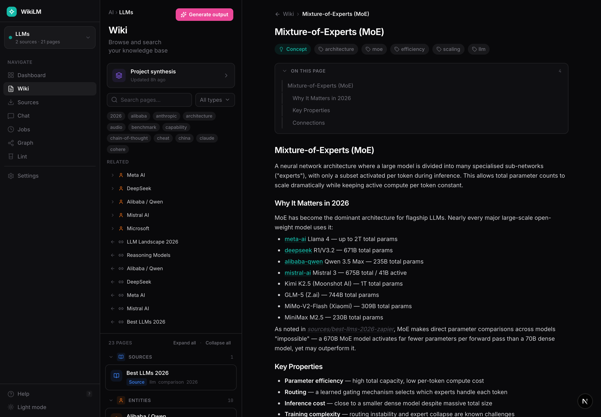
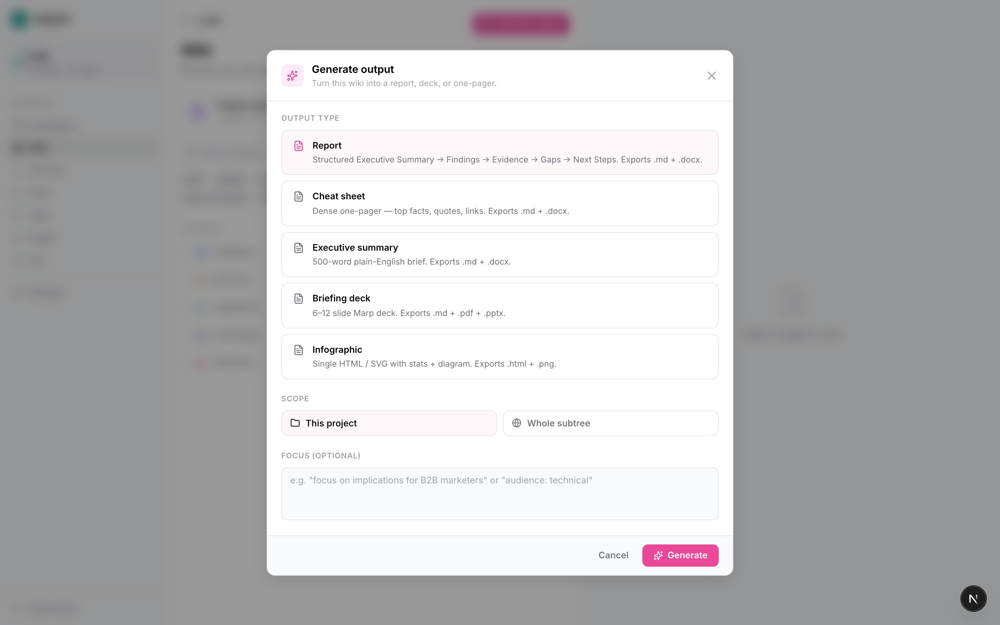
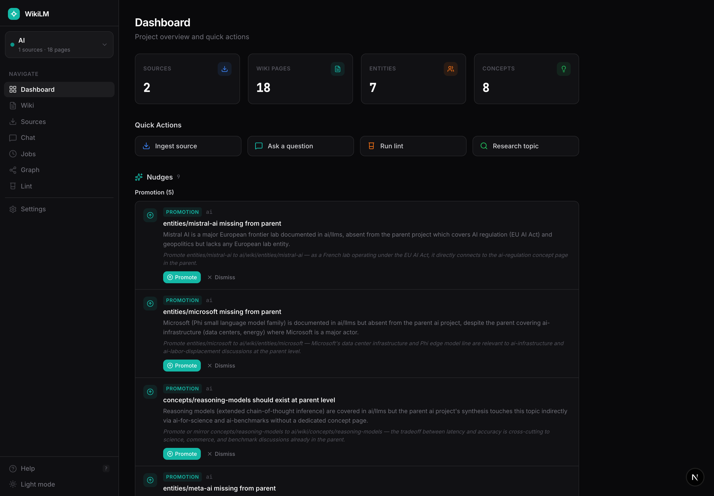
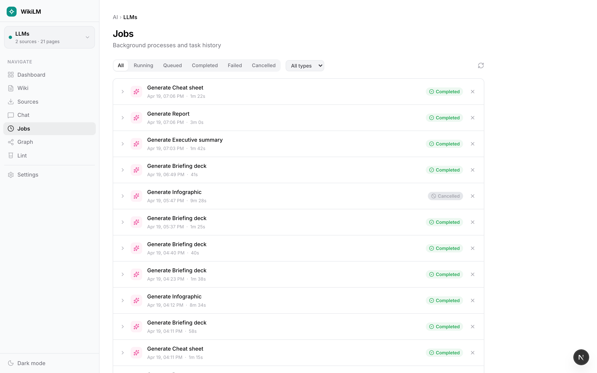
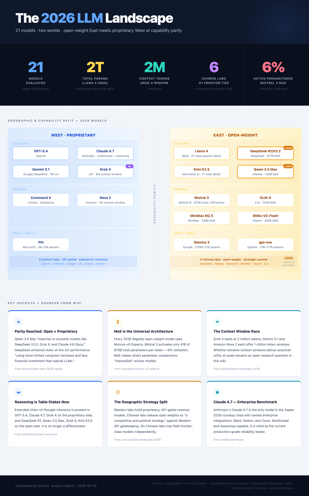

# WikiLM — v1.5-beta

> **v1.5-beta ships the editorial-brutalist UI, multi-provider model routing (Claude / Gemini / Ollama), and inline infographic previews.** v1-alpha is preserved at the `v1-alpha` git tag. This README tracks v1.5-beta; see the tag if you need the older design.

A local-first personal knowledge base where an LLM does the maintenance work. Drop raw material into `raw/`, the LLM reads it, writes structured interlinked markdown into `wiki/`, and keeps the graph clean as it grows. Everything stays on your machine as plain files.

Built around the pattern Andrej Karpathy described in his [LLM wiki gist](https://gist.github.com/karpathy/442a6bf555914893e9891c11519de94f) — raw sources go in, compiled knowledge comes out — extended with a full editorial-brutalist web UI, nested projects, a job queue, NotebookLM-style output generation, multi-provider model routing, and an MCP server so you can talk to the wiki from any Claude Code session.

## What's new in v1.5-beta

- **Editorial-brutalist frontend.** Fraunces + Instrument Serif + JetBrains Mono type stack. Four paper themes (Paper · Stone · Celadon · Night), five ink accents, three densities, four serif faces, three global sizes — all live-switchable via the ⌘T Tweaks panel. Every page redesigned: Ledger (dashboard), Wiki (article reader with margin cards + hover preview), Intake (sources), Dispatch (jobs), Map (force-directed graph), Dictation (compose), Chat, Lint, Settings.
- **Multi-provider model routing.** Per-job-type model selection in Settings:
  - **Claude** — `sonnet`, `opus`, `haiku` aliases + explicit IDs
  - **Gemini** — `gemini-3-flash-preview`, `gemini-3.1-pro-preview` via the `gemini` CLI with Google Search grounding
  - **Ollama** — any locally-installed model (`qwen2.5-coder`, `gemma`, etc.) via local HTTP
  
  Settings shows live availability pings. Research is locked to grounded providers (Ollama disabled with a tooltip). All failure modes classified: `provider_unavailable`, `model_not_found`, `rate_limited`, `auth_failed` — rendered as friendly titles with actionable descriptions across `/jobs` and `/compose`.
- **Inline output artifacts.** Infographics now show a PNG preview directly on the wiki page; click the image to open the interactive HTML in a new tab. Ext pills force download. Decks render via themed Marp (Gaia + custom dark gradient), infographic PNG via headless Chrome, docx via `docx` library.
- **In-app note capture.** Write a note directly from `/sources` (composer modal with project picker + ingest-now toggle), or save a chat thread as a note from `/chat`.
- **Project management UI.** Add child, move, delete (with full cascade). ⋯ menu on every project in the sidebar tree.
- **Hover preview cards.** Wikilinks show a portal-rendered preview card that tracks the cursor via rAF-batched transforms. No flicker, no lag, no layout thrash.
- **⌘K palette.** NL-intent router (`go to …`, `find …`, `generate …`, `switch project …`). Keyboard-first navigation.
- **Quality-of-life:** editorial toast singleton, responsive breakpoints, breadcrumbs everywhere, job beacon in the topbar, sticky margin cards, in-app `?` help, keyboard shortcuts.

## What it does

**Wiki maintenance.** Ingest a URL, an uploaded file, or a pasted note. The selected ingestion model reads it, writes a source summary, extracts entities and concepts into their own pages, and stitches everything together with `[[wikilinks]]`. A single source typically touches 5–15 pages. Updates to existing pages happen in place — knowledge compounds.

**Nested projects.** Organize multiple wikis under a single tree (e.g. `ai/llms`, `coding/codeview`). Cross-project wikilinks resolve. Parent projects get their own synthesis rolled up from children. Dashboard **Nudges** surface cross-project patterns (promotion candidates, recurring themes, parent gaps) only a parent-level lint can see.

**Output generation (NotebookLM-style).** From any wiki page, click **✦ Generate output** to produce a polished artifact in one of five formats:

| Type | Primary | Companion | Use case |
|------|---------|-----------|----------|
| Report | `.md` | `.docx` | Long-form, citations, export to Word |
| Executive summary | `.md` | `.docx` | 1-page brief for stakeholders |
| Cheat sheet | `.md` | `.docx` | Scannable reference card |
| Deck | `.md` | `.pdf` + `.pptx` | Marp-rendered themed slides |
| Infographic | `.html` | `.png` | Single-page visual, inline SVG; PNG previews on the wiki page, click opens HTML |

Outputs can be scoped to the current page or the whole subtree, optionally nudged with a custom instruction (audience, tone, focus), and appear in the wiki list so you can link them like any other page. The model that generated each artifact is written into its frontmatter for provenance. Base slugs include an `HHmm` timestamp so regenerations never silently overwrite earlier artefacts.

**Model routing.** Every job type (ingest, research, synthesis, chat, query, lint, fix, output, note-summary, concept-fill) has its own model setting. Pick fast-and-cheap `haiku` for lint + fix, `sonnet` for ingest, grounded Gemini Pro for research, local `qwen` for sensitive note summaries. All providers fail gracefully with structured error codes rendered as friendly messages.

**Lint with auto-fix.** Claude scans the project for orphans, contradictions, missing cross-references, concept gaps, stale claims. Each finding has **Fix** (per-finding), **Fix all** (bulk per category), **Promote** (copy or move across nested projects), **Create concept** (fires a real concept-fill job that populates the page with evidenced content from the wiki), **Research** (jumps to /sources research pre-seeded with the topic), or **Dismiss**.

**MCP server.** A built-in [Model Context Protocol](https://modelcontextprotocol.io) server lets any Claude Code session read and write the wiki based on your current working directory. Nine tools: list projects, search, read, list pages, get synthesis, save a learning, generate an output, check job status, create a project. See `mcp/README.md` for configuration.

**Local-first.** All data is plain markdown files on disk. SQLite for job state, jobs queue, sources index. No cloud, no embeddings DB, no vendor lock-in — open the folder in Obsidian any time.

## Screenshots

> **Note:** Screenshots below are from v1-alpha and need to be re-captured for the v1.5-beta editorial UI. See **"Regenerating screenshots"** below.

### Wiki — concept page
A concept page opened in the detail pane. Everything the LLM writes is structured markdown with `[[wikilinks]]` — each link shows a hover preview card that follows the cursor. The right margin holds the table of contents; backlinks appear below the fold. Every Wiki element renders under the active theme + accent + density + face + size combo from the Tweaks panel.



### Wiki — synthesis page
Synthesis pages are LLM-written overviews that cluster pages across a project around a theme. They regenerate automatically after each ingest (or on demand) so the "big picture" view of the knowledge base stays in sync as sources pile up. Parent-level synthesis (when enabled in Settings) cascades across children.


### Generate output modal
Pick a type, choose scope (this page or the whole subtree), optionally add a **focus nudge** to bias the prompt (e.g. "audience: technical" or "focus on commercial implications"). Generation runs as a background job — you can close the modal, keep working, and pick up the artifact when it lands.



### Lint — wiki health check
Click **Run lint** to have the configured lint model scan the whole project for quality issues. Fix / Fix-all / Promote (move or copy) / Create concept / Research / Dismiss — all one-click.


### Dashboard — Nudges (parent-scoped findings)
Nudges are cross-project patterns only parent-level lint can see. Promote → moves or copies the page up the tree; Create concept → populates a scaffolded page via a real wiki-grounded job.



### Dispatch (Jobs)
Every subprocess — ingest, synthesis, lint, research, output generation, note summary — shows up here with type icon, model badge, structured status, and per-row cancel. Failures render `formatJobError` output (e.g. "Rate limited. Wait a minute and retry, or switch to Flash (higher quota).").



### Intake (Sources)
Ingested material with humanized subtitles (domain, summary, or type label — never raw JSON). Two tabs: Library for existing sources, Research for live web searches that stream `RESULT:` lines you can approve into the wiki.


### In-app help
Press `?` anywhere, or click **Help** in the sidebar footer, for a walkthrough of the idea, the flow, and what each page does.


### Regenerating screenshots

The screenshots above still show v1-alpha. To re-shoot for v1.5-beta:

1. `cd app && npm run dev`
2. Open an existing project with real content (e.g. the `ai/llms` or `e2e-rag-test` project included in this repo)
3. Navigate to each screen in the list above, capture at ~1440×900
4. Save with the same filename into `docs/screenshots/` (preserves the README image links)
5. Recommended themes for variety: Paper (default) for Wiki/Sources, Stone for Lint, Celadon for Graph, Night for Jobs

An additional screenshot worth adding for v1.5-beta: a rendered infographic output page showing the inline PNG preview + "Open interactive HTML" button.

## Example output

The infographic below was generated end-to-end from the `ai/llms` project — a single `Generate output` click produced the prompt, fed it to Claude with wiki context, wrote the HTML, and rendered the PNG via headless Chrome. No hand-tuning.



## Setup

See [SETUP.md](SETUP.md) for the full walkthrough. Quick version:

```bash
cd app
cp .env.example .env.local        # mock mode by default — no API key needed to explore
npm install
npm run db:push                   # create the SQLite database
npm run dev                       # http://localhost:3000
```

To use real providers:

- **Claude** — install the `claude` CLI (`claude --help`). This is the install prerequisite; Settings assumes it's present.
- **Gemini** — `npm i -g @google/gemini-cli`, then run `gemini` once to authenticate. Settings shows an availability ping.
- **Ollama** — install Ollama + `ollama pull <model>`. Settings shows the model list live.

Flip `MOCK_MODE=false` in `.env.local` when you're ready to burn real tokens.

For PDF/PPTX deck rendering and infographic PNG rendering, the post-job hooks use Marp CLI and system Chrome respectively. Both are optional — the primary markdown or HTML artifact always lands, and companion formats fail gracefully.

## MCP (use from any Claude Code session)

Register once globally:

```bash
cd mcp
npm install
npm run build
claude mcp add --scope user wikilm node $(pwd)/dist/index.js
```

Now in any Claude Code session, anywhere on disk, Claude can list your projects, search across all wikis, read a page, save a learning, or generate an output — scoped automatically to the project whose filesystem path matches your cwd.

Full tool list and configuration: [mcp/README.md](mcp/README.md).

## Layout

```
SecondBrain/
  raw/                     # Source material — never modified by the LLM
  wiki/                    # Top-level wiki (LLM-owned)
  projects/<slug>/
    raw/
    wiki/                  # Project-scoped wiki
      outputs/             # Generated reports, decks, infographics…
  app/                     # Next.js 16 app (editorial UI + API + job queue)
    src/components/editorial/  # Editorial-brutalist component library
  mcp/                     # MCP server (stdio, @modelcontextprotocol/sdk)
  docs/                    # Screenshots + design notes
  design_handoff_wikilm_editorial/  # v1.5-beta design source + mock
```

## Versions

| Tag | Shipped | What it is |
|---|---|---|
| `v1-alpha` | Earlier 2026 | Initial WikiLM: shadcn UI, nested projects, MCP v1, output generation, lint, nudges |
| `v1.5-beta` | 2026-04-21 | Editorial-brutalist redesign, multi-provider model routing, inline infographic previews, structured error codes, note capture |

Check out an older version with `git checkout v1-alpha`.

## Credits

The core pattern — raw sources in, LLM-maintained markdown wiki out, everything as plain files — comes from [Andrej Karpathy's LLM wiki gist](https://gist.github.com/karpathy/442a6bf555914893e9891c11519de94f). This project extends that pattern with a UI, nested projects, output generation, and MCP integration, but the shape of the idea is his.

## License

Personal project. No license granted for external use without permission.
