# WikiLM — v1.5-beta

> **v1.5-beta ships the editorial-brutalist UI, multi-provider model routing (Claude / Gemini / Ollama), and inline infographic previews.** v1-alpha is preserved at the `v1-alpha` git tag. This README tracks v1.5-beta; see the tag if you need the older design.

A local-first personal knowledge base where an LLM does the maintenance work. Drop raw material into `raw/`, the LLM reads it, writes structured interlinked markdown into `wiki/`, and keeps the graph clean as it grows. Everything stays on your machine as plain files.

Built around the pattern Andrej Karpathy described in his [LLM wiki gist](https://gist.github.com/karpathy/442a6bf555914893e9891c11519de94f) — raw sources go in, compiled knowledge comes out — extended with a full editorial-brutalist web UI, nested projects, a job queue, NotebookLM-style output generation, multi-provider model routing, and an MCP server so you can talk to the wiki from any Claude Code session.

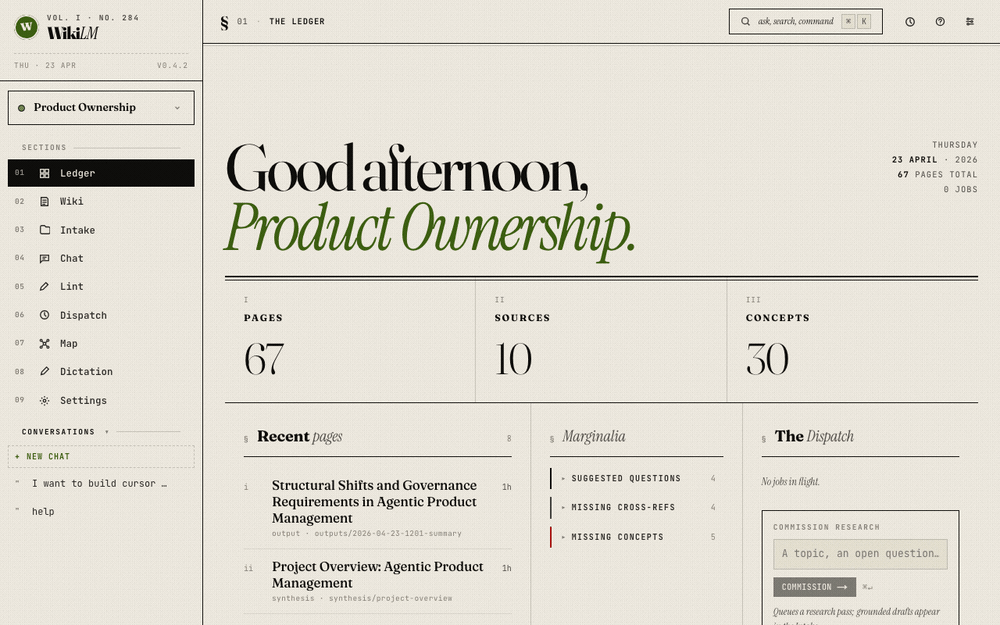

> ~16-second tour through a real `product-ownership` wiki covering every main journey:
>
> 1. **Ledger** — greeting, stat run, nudges.
> 2. **Wiki article** — concept page with margin cards, scrolled.
> 3. **Wikilink hover preview** — portal-rendered cursor-tracked preview card.
> 4. **Synthesis** — project-overview page with *Updated · …* timestamp.
> 5. **Synthesis hover** — a second wikilink preview on a synthesis link.
> 6. **Salon (chat)** — a seeded multi-turn conversation about *Cursor for POs*, scrolled through to show Q/A pairs.
> 7. **The Edit (lint)** — findings grouped by category, Fix / Dismiss actions visible.
> 8. **Dictation** — filed outputs list with download + delete affordances.
> 9. **Back to Ledger** — closing frame.
>
> Re-record any time with `node scripts/capture-demo-gif.mjs` (dev server on :3000). Frames are driven by puppeteer-core; GIF is stitched by `ffmpeg-static` — no system install required.

## What's new in v1.5-beta

- **Editorial-brutalist frontend.** Fraunces + Instrument Serif + JetBrains Mono type stack. Four paper themes (Paper · Stone · Celadon · Night), five ink accents, three densities, four serif faces, three global sizes — all live-switchable via the ⌘T Tweaks panel. Every page redesigned: Ledger (dashboard), Wiki (article reader with margin cards + hover preview), Intake (sources), Dispatch (jobs), Map (force-directed graph), Dictation (compose), Chat, Lint, Settings.
- **Multi-provider model routing.** Per-job-type model selection in Settings:
  - **Claude** — `sonnet`, `opus`, `haiku` aliases + explicit IDs
  - **Gemini** — `gemini-3-flash-preview`, `gemini-3.1-pro-preview` via the `gemini` CLI with Google Search grounding
  - **Ollama** — any locally-installed model (`qwen2.5-coder`, `gemma`, etc.) via local HTTP
  
  Settings shows live availability pings. Research is locked to grounded providers (Ollama disabled with a tooltip). All failure modes classified: `provider_unavailable`, `model_not_found`, `rate_limited`, `auth_failed` — rendered as friendly titles with actionable descriptions across `/jobs` and `/compose`.
- **Inline output artifacts.** Infographics now show a PNG preview directly on the wiki page; click the image to open the interactive HTML in a new tab. Ext pills force download. Decks render via themed Marp (Gaia + custom dark gradient), infographic PNG via headless Chrome, docx via `docx` library.
- **In-app note capture.** Write a note directly from `/sources` (composer modal with project picker + ingest-now toggle), or save a chat thread as a note from `/chat`.
- **Project management UI.** Add child, move, delete (with full cascade). ⋯ menu on every project in the sidebar tree.
- **Hover preview cards.** Wikilinks show a portal-rendered preview card that tracks the cursor via rAF-batched transforms. No flicker, no lag, no layout thrash.
- **⌘K palette.** NL-intent router (`go to …`, `find …`, `generate …`, `switch project …`). Keyboard-first navigation.
- **Quality-of-life:** editorial toast singleton, responsive breakpoints, breadcrumbs everywhere, job beacon in the topbar, sticky margin cards, in-app `?` help, keyboard shortcuts.

## Public-release updates (post v1.5-beta)

Follow-up work layered on after the stabilisation cut. Everything below is on `main`.

- **Knowledge-bank help.** New `/help` page with left-rail TOC and 27 topics across Concepts, Workflows, Providers, MCP, Navigation, and Troubleshooting. The `?` modal is a glance card with an "Open full help →" button in its header. The same help digest is prepended to every chat prompt so the Salon can answer "how do I…" questions inline with pointers into the knowledge bank.
- **Ledger empty-state CTA.** Fresh-install projects show a prominent *Want to explore something new?* card with buttons to Intake and /help. Disappears automatically once the project has any source.
- **Dictation outputs list.** `/compose` now surfaces every filed output below the generator: format pill, relative timestamp, Open / download / delete actions. Delete removes the row optimistically, sweeps every companion file, and broadcasts a `wikilm:outputs-changed` custom event — the wiki index listens and re-renders. Cross-page sync in both directions without reloads.
- **Install as web app.** PWA manifest + SVG icon at `app/public/`. Chrome / Edge / Arc → ⋯ menu → *Install app*, Safari → File → *Add to Dock…* gets you a standalone window with a real Dock icon. A `scripts/launch-wikilm.command` double-click launcher boots the dev server in the background and opens `localhost:3000` in the default browser — no terminal once set up.
- **Modal portals.** Every modal (Generate Output, Note composer, Help, Quick-generate, Move project, research-clear warning) now renders via `createPortal` into `document.body` so `position: fixed` escapes the `zoom: var(--fs-scale)` ancestor on `.content`. No more off-screen modals when triggered from a mid-scroll page.
- **Research persistence race fix.** Results survive tab/page/project navigation. The persist effect was writing `[]` to localStorage before the load effect's setResults re-rendered — a `loadedForProjectRef` gate prevents that. New inline modal (not `window.confirm`) warns before a research topic change clears the existing list.
- **Synthesis timestamp.** Wiki reader masthead shows `Updated · 2h` for synthesis pages, sourced from file mtime so it's honest even when the synthesis job doesn't update frontmatter.
- **Retry failed sources.** Intake rows in `failed` status show a **Retry** button that re-runs the ingest job and now triggers synthesis on completion (approve + retry previously skipped this).
- **Chat UX.** Textarea auto-resizes as you type (capped at 200px). The prompt wrapper explicitly forbids process narration ("I will start by reading the wiki's index…") so chat answers start with the substantive reply.
- **Lint UX.** Run-lint button optimistically flips to "Linting…" immediately and starts polling — findings appear on the page when the job completes instead of requiring a navigate-away-and-back.
- **Marginalia lint highlights.** Ledger Marginalia now also surfaces project-scope lint findings (suggested questions, missing cross-refs, missing concepts) as collapsible groups with a *View N more in Lint →* link. Collapsed by default so the Ledger stays scannable.
- **Project tree ⋯ menu.** Move / Delete finally fire (ref attached to menu div; doc listener uses contains-check). Delete failures surface the real server error in the toast (e.g. "Cannot delete a project that has children").
- **Source upload fixes.** Field-name mismatch (`file` vs `files`) + per-project raw dir (was writing to top-level `raw/` regardless of project). Uploads now land in the correct project and ingestion finds them.
- **Cleaner source cards.** Extract line reads *"Note · ingested."* (or type-appropriate label) once the row is done — no more false "awaiting ingestion" on already-ingested rows.

## What it does

**Wiki maintenance.** Ingest a URL, an uploaded file, or a pasted note. The selected ingestion model reads it, writes a source summary, extracts entities and concepts into their own pages, and stitches everything together with `[[wikilinks]]`. A single source typically touches 5–15 pages. Updates to existing pages happen in place — knowledge compounds.

**Nested projects.** Organize multiple wikis under a single tree (e.g. `ai/llms`, `coding/codeview`). Cross-project wikilinks resolve. Parent projects get their own synthesis rolled up from children. Dashboard **Nudges** surface cross-project patterns (promotion candidates, recurring themes, parent gaps) only a parent-level lint can see.

**Output generation (NotebookLM-style).** From any wiki page, click **✦ Generate output** to produce a polished artifact in one of five formats:

| Type | Primary | Companion | Use case |
|------|---------|-----------|----------|
| Report | `.md` | `.docx` | Long-form, citations, export to Word |
| Executive summary | `.md` | `.docx` | 1-page brief for stakeholders |
| Cheat sheet | `.md` | `.docx` | Scannable reference card |
| Deck | `.md` | `.pdf` + `.pptx` | Marp-rendered themed slides |
| Infographic | `.html` | `.png` | Single-page visual, inline SVG; PNG previews on the wiki page, click opens HTML |

Outputs can be scoped to the current page or the whole subtree, optionally nudged with a custom instruction (audience, tone, focus), and appear in the wiki list so you can link them like any other page. The model that generated each artifact is written into its frontmatter for provenance. Base slugs include an `HHmm` timestamp so regenerations never silently overwrite earlier artefacts.

**Model routing.** Every job type (ingest, research, synthesis, chat, query, lint, fix, output, note-summary, concept-fill) has its own model setting. Pick fast-and-cheap `haiku` for lint + fix, `sonnet` for ingest, grounded Gemini Pro for research, local `qwen` for sensitive note summaries. All providers fail gracefully with structured error codes rendered as friendly messages.

**Lint with auto-fix.** Claude scans the project for orphans, contradictions, missing cross-references, concept gaps, stale claims. Each finding has **Fix** (per-finding), **Fix all** (bulk per category), **Promote** (copy or move across nested projects), **Create concept** (fires a real concept-fill job that populates the page with evidenced content from the wiki), **Research** (jumps to /sources research pre-seeded with the topic), or **Dismiss**.

**MCP server.** A built-in [Model Context Protocol](https://modelcontextprotocol.io) server lets any Claude Code session read and write the wiki based on your current working directory. Nine tools: list projects, search, read, list pages, get synthesis, save a learning, generate an output, check job status, create a project. See `mcp/README.md` for configuration.

**Local-first.** All data is plain markdown files on disk. SQLite for job state, jobs queue, sources index. No cloud, no embeddings DB, no vendor lock-in — open the folder in Obsidian any time.

## Screenshots

Captured against the `e2e-rag-test` project in Paper theme at 1440×900 @2x. Re-shoot any time with `node scripts/capture-screenshots.mjs` (dev server must be running on :3000).

### Ledger (dashboard)
`Good afternoon, E2E · RAG Test.` — the greeting picks up the active project. Below, stat run (pages / sources / concepts), recent pages, Marginalia for nudges, and the Dispatch card for firing live research without leaving the room.

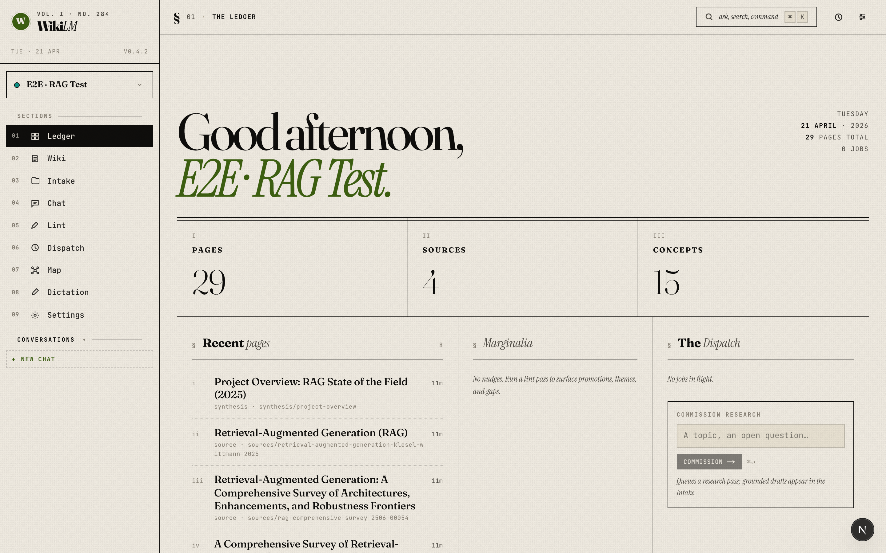

### Wiki — concept page
The hub concept for the project. Everything the LLM writes is structured markdown with `[[wikilinks]]` — each link shows a hover preview card that tracks the cursor. The right margin holds the generated TOC; byline strip carries words / read / backlinks / sources / type / updated.

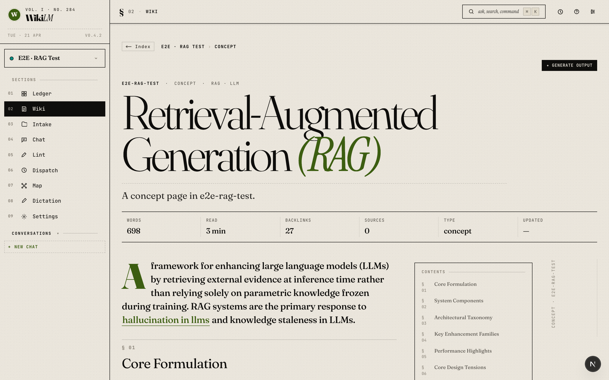

### Wiki — synthesis page
Synthesis pages are LLM-written overviews that cluster pages across a project around a theme. They regenerate automatically after each ingest so the "big picture" stays in sync as sources pile up. Parent-level synthesis (opt-in in Settings) cascades across children.

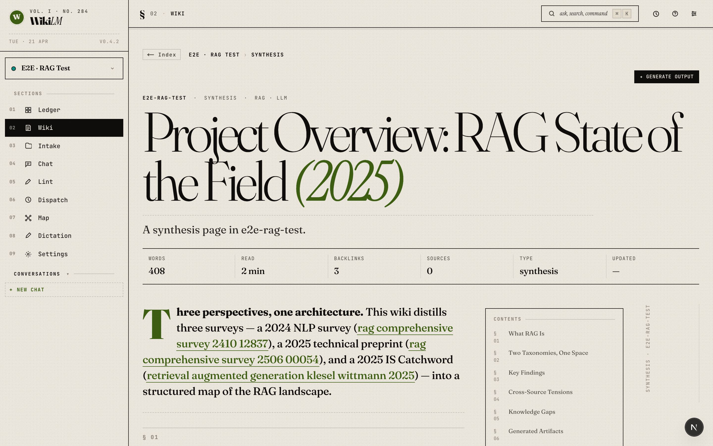

### Wiki — infographic output (v1.5-beta)
Infographic outputs now render the PNG inline on the wiki page, boxed in the editorial ink-border style. Click the image — or the primary **Open interactive HTML ↗** button below it — to load the interactive HTML in a new tab. Ext pills force download.

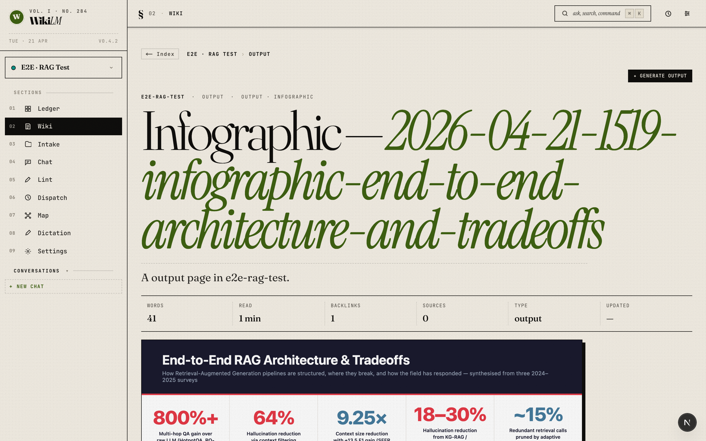

### Intake (Sources)
Ingested material with humanized subtitles — never raw JSON. Two tabs: Library for existing sources, Research for live web searches that stream `RESULT:` lines you can approve into the wiki.

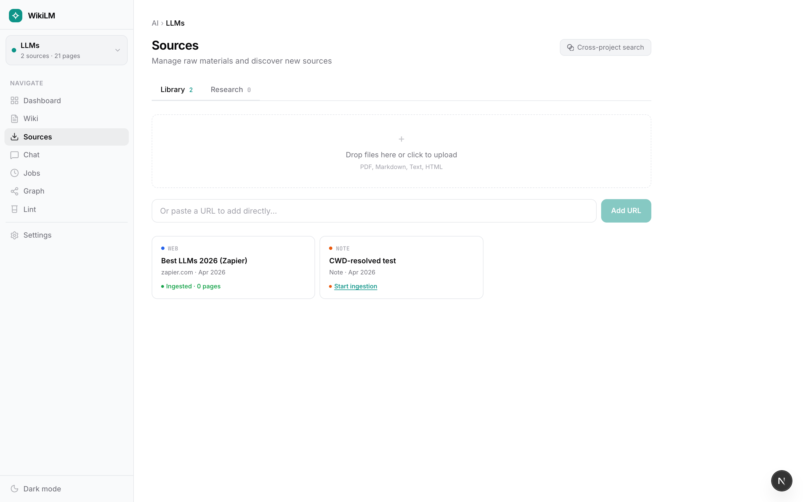

### Lint — The Edit
Click **Run lint** to have the configured lint model scan the whole project for contradictions, orphans, missing cross-references, concept gaps, stale claims. Fix / Fix-all / Promote (move or copy) / Create concept / Research / Dismiss — all one-click.

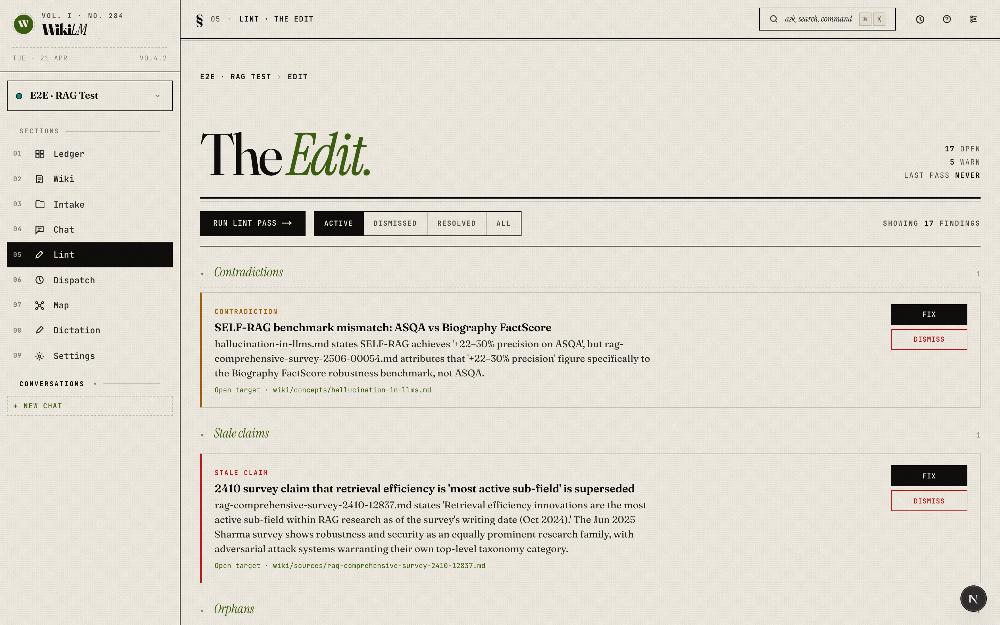

### Dispatch (Jobs)
Every subprocess — ingest, synthesis, lint, research, output generation, note summary — shows up here with type icon, model badge, structured status, and per-row cancel. Failures render `formatJobError` output (e.g. "Rate limited. Wait a minute and retry, or switch to Flash (higher quota).").

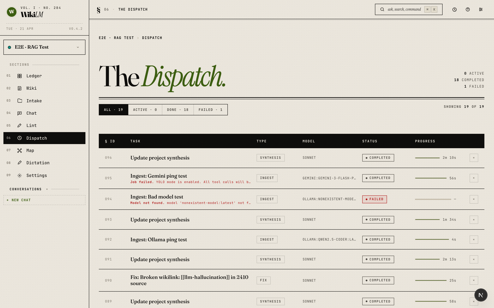

### The Map
Force-directed knowledge graph for the active project. Legend categories (concepts / entities / sources / outputs / synthesis) click to isolate; wheel to zoom, drag to pan. Hubs pulse — in this shot `retrieval-augmented-generation` is centre-stage.

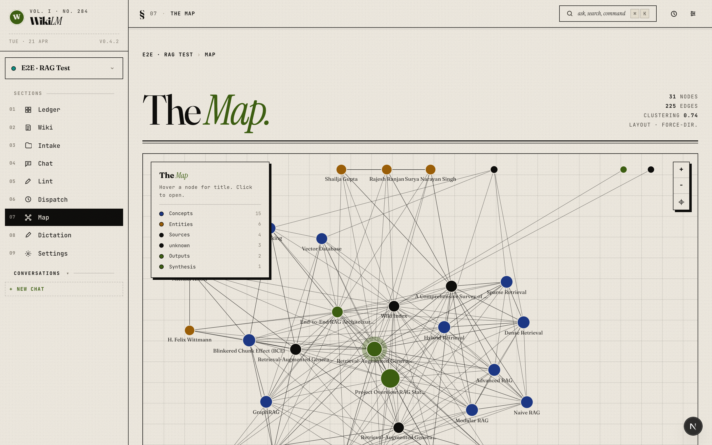

### Settings — The Press
Per-job-type model routing with live availability pings for Ollama + Gemini. Research is locked to grounded providers (Ollama disabled with a tooltip). Also holds the theme / accent / density / face / size tweaks, backup controls, and Claude-CLI status.

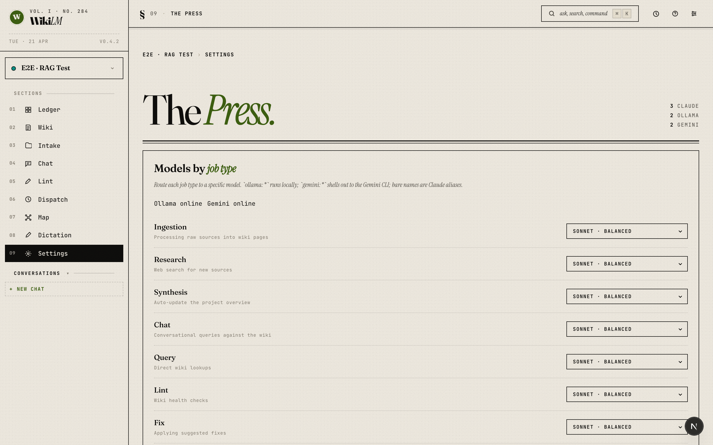

### Chat (Salon)
Ask WikiLM about the active project. Multi-turn context grounded in the project's wiki. Save a thread as a pending note with one click — summarisation runs as a job and lands in Intake.

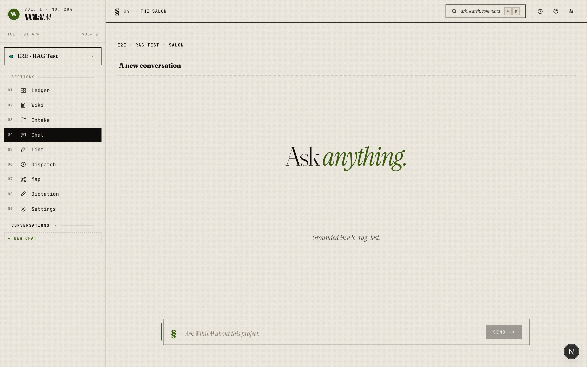

### Compose (Dictation)
Pick an output type, set scope, optionally add a focus nudge. Generation runs as a background job so you can close the page and come back — the artifact shows up in the wiki list when it lands.

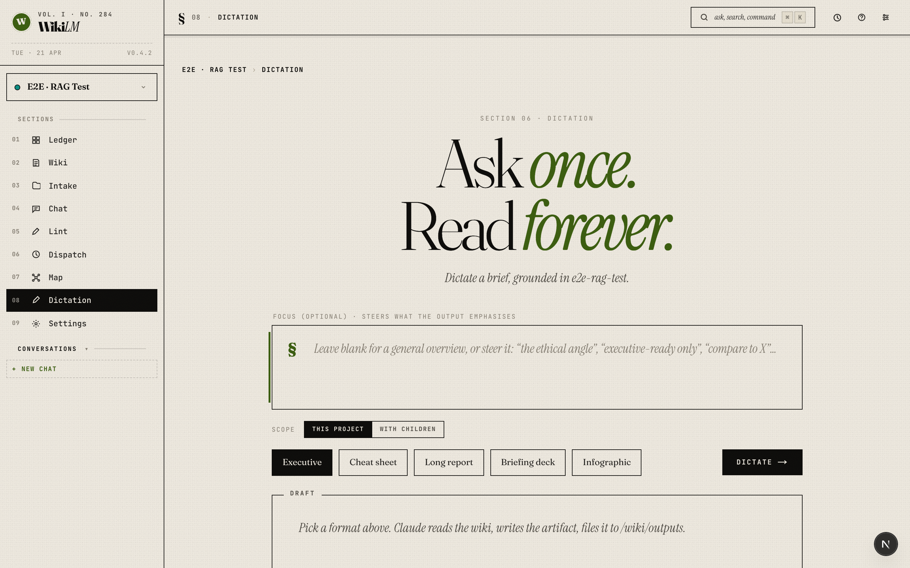

### Help modal
Press `?` anywhere, or click **Help** in the sidebar footer, for a walkthrough of the idea, the flow, and what each page does.

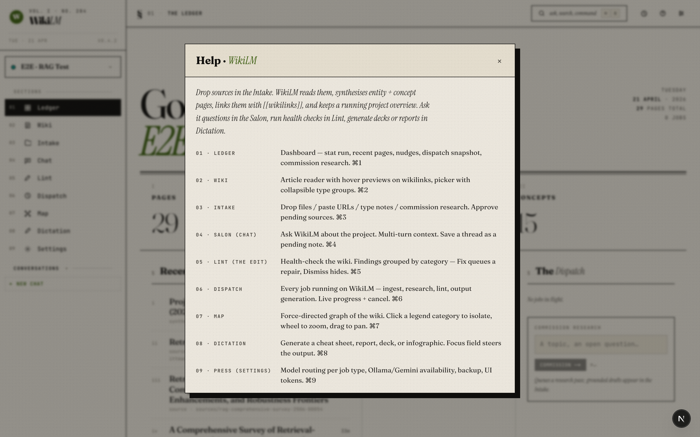

### ⌘K palette
Natural-language intent routing across the whole app. Type a query, command, or page name; jumps to search, research, lint runs, or a specific page.

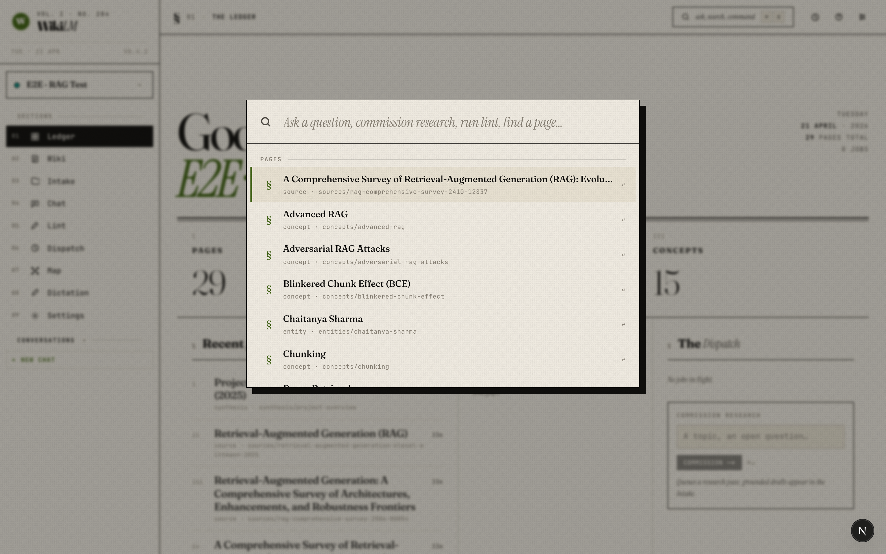

## Setup

### AI-led install (recommended)

Let Claude Code drive the install. From a fresh clone:

```bash
git clone https://github.com/stonekey908/wikilm.git
cd wikilm
claude
```

Then paste:

> Read SETUP.md and walk me through the setup interactively, one step at a time. Write credentials directly to `app/.env.local` as I provide them. Start in mock mode so I can explore before I add API keys.

Claude will ask about your target providers (Claude / Gemini / Ollama), handle `npm install` + `npm run db:push`, boot the dev server, and only prompt you for the bits that need human eyes (API keys, CLI authentication). If you hit a snag, it'll update SETUP.md with what actually happened.

### Manual install

See [SETUP.md](SETUP.md) for the full walkthrough. Quick version:

```bash
cd app
cp .env.example .env.local        # mock mode by default — no API key needed to explore
npm install
npm run db:push                   # create the SQLite database
npm run dev                       # http://localhost:3000
```

To use real providers:

- **Claude** — install the `claude` CLI (`claude --help`). This is the install prerequisite; Settings assumes it's present.
- **Gemini** — `npm i -g @google/gemini-cli`, then run `gemini` once to authenticate. Settings shows an availability ping.
- **Ollama** — install Ollama + `ollama pull <model>`. Settings shows the model list live.

Flip `MOCK_MODE=false` in `.env.local` when you're ready to burn real tokens.

For PDF/PPTX deck rendering and infographic PNG rendering, the post-job hooks use Marp CLI and system Chrome respectively. Both are optional — the primary markdown or HTML artifact always lands, and companion formats fail gracefully.

## MCP (use from any Claude Code session)

Register once globally:

```bash
cd mcp
npm install
npm run build
claude mcp add --scope user wikilm node $(pwd)/dist/index.js
```

Now in any Claude Code session, anywhere on disk, Claude can list your projects, search across all wikis, read a page, save a learning, or generate an output — scoped automatically to the project whose filesystem path matches your cwd.

Full tool list and configuration: [mcp/README.md](mcp/README.md).

## Layout

```
SecondBrain/
  raw/                     # Source material — never modified by the LLM
  wiki/                    # Top-level wiki (LLM-owned)
  projects/<slug>/
    raw/
    wiki/                  # Project-scoped wiki
      outputs/             # Generated reports, decks, infographics…
  app/                     # Next.js 16 app (editorial UI + API + job queue)
    src/components/editorial/  # Editorial-brutalist component library
  mcp/                     # MCP server (stdio, @modelcontextprotocol/sdk)
  docs/                    # Screenshots + design notes
```

## Versions

| Tag | Shipped | What it is |
|---|---|---|
| `v1-alpha` | Earlier 2026 | Initial WikiLM: shadcn UI, nested projects, MCP v1, output generation, lint, nudges |
| `v1.5-beta` | 2026-04-21 | Editorial-brutalist redesign, multi-provider model routing, inline infographic previews, structured error codes, note capture |

Check out an older version with `git checkout v1-alpha`.

## Credits

The core pattern — raw sources in, LLM-maintained markdown wiki out, everything as plain files — comes from [Andrej Karpathy's LLM wiki gist](https://gist.github.com/karpathy/442a6bf555914893e9891c11519de94f). This project extends that pattern with a UI, nested projects, output generation, and MCP integration, but the shape of the idea is his.

## License

Personal project. No license granted for external use without permission.
